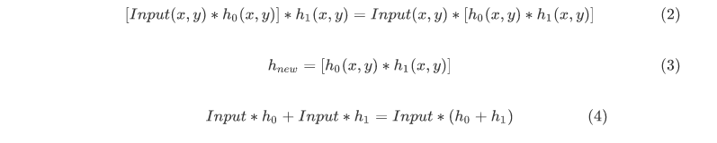
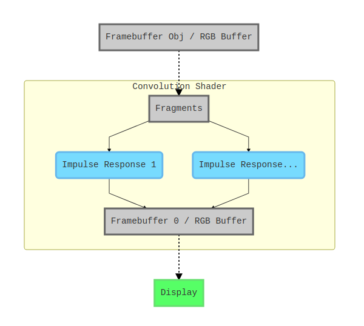

# Prototype-01
Signals &amp; Systems, course project.
## Introduction

Image processing always contains lots of floating point operations (Flops), so that deploying these computing to GPUs via modern OpenGL (with programmable shader support) make it more efficient and possible for realtimes use, because GPUs are designed for parallel computing.

Here's a brief comparing between two types of image processing:

| Items                | Traditional (CPU)  | OpenGL 4  (GPU) |
| -------------------- | ------------------ | --------------- |
| Parallel Computing   | By Multi-threading | Native Support  |
| Performance per Watt | < 5 GFlops         | 25 ~ 60 GFlops  |

  

In this project, we use the **Fragment Shader** in modern OpenGL to do the computing in some simple image processing operations.

The diagram shows the structure of the program


The image / input signal is distributed and sent to the fragment shader, then the original signal is convoluted with the two-dimentional impulse response matrix.

By changing the impulse response we can modify the behaviour of the system.

## Results

**Edge Detect**


  

**Blur**


  

**Edge Enhanced** :Edge Detect + Original Signal


**Per RGB Channel** : blurring red component only.


  

**Edge Detect** :cascaded with Grayscale


  

**Bloom**


  

### Impulse Response

The prototype of the calculation in shaders is :


Every pixel with 24bit scalar is treated as a pulse.

In order to get new impluse response matrix, it's single-axis unit step response can be found, and then differentiation is applied to it to get one-axis impluse response. After that, the impluse response was expanded to two dimentional matrix to get the correct response matrix.

For example, the impulse response used in edge detection is shown below.


The impluse response h(x,y) is descripted in a matrix, and it can be extended to 5x5 or 7x7 for better experience:

```glsl
//GLSL Code for edge detection (3x3 simple example)
vec2 mat_xy[9] = vec2[]	//defines position
(
	vec2(-offset, offset),	vec2( 0.0f,offset),		vec2( offset, offset),
	vec2(-offset, 0.0f),	vec2( 0.0f,0.0f),		vec2( offset, 0.0f),
	vec2(-offset, -offset),	vec2( 0.0f, -offset),	vec2( offset, -offset)
);

float mat_h[9] = float[]	//defines response amplitude
(
	-1, -1, -1,
	-1, 8, -1,
	-1, -1, -1
);
```

  

The convolution is done by :

```c
for(int i = 0; i < 9; i++)
	sampleTex[i] = vec3(texture(fbotexture, TexPos.st + mat_xy[i]));//sampling

vec3 col = vec3(0.0);

for(int i = 0; i < 9; i++)
	col += mat_xy[i] * mat_h[i];
	
FragColor = vec4(col, 1.0);//output the color with alpha=1.0
```

The summation of all the components in the impulse response are always between 0 and 1, for the "energy" in the signal doesn't run out of the 24bit RGB color range, and the distortion caused by the rounding in RGB color buffer is acceptable for displaying results.


### External Functions

**Cascading / Adding**

Because the h(x,y) describes an LTI system, so it shares other properties of the LTI system.



**Seperated RGB Channel**

if we only wants one of the RGB components, we can process them seperately :

```glsl
float h0_red[9] = float[](
	0,0,0,
	0,1,0,
	0,0,0);

float h0_green[9] = float[](
	1.0/16, 2.0/16, 1.0/16,
	2.0/16, 4.0/16, 2.0/16,
	1.0/16, 2.0/16, 1.0/16);

float h0_blue[9] = float[](
	0,0,0,
	0,1,0,
	0,0,0);
```

More effects can be done by using the combinations of these impulse responses:

- Blooming
- Seperated channel blurring
- Edge enhancing / detecting
- ...

### Overall Structure

The program includes several parts :

- Main Logic
  - GLFW : connecting OpenGL with the window manager.
  - GLEW : initialize modern OpenGL 4.5 APIs.
  - Scheduling framebuffer objects(FBOs) and resources.


- OpenGL related
  - Shader / Model / Camera : C++ Class Libraries.
  - *.glsl : GLSL scripts, loaded at runtime.


The main render loop is shown below :



The first framebuffer object (FBO) stores the previous rendered result and stores the color buffer into a texture, then the texture is sampled by the fragment shader and convoluted with the impulse response inside. The convoluted results are summed together in the RGB buffer in another FBO (Framebuffer 0, attached to the display) , and it is then displayed on the screen.

If the results need to be stored to image files, we can use other tools such as libpng / stb_image.
