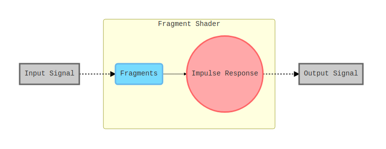
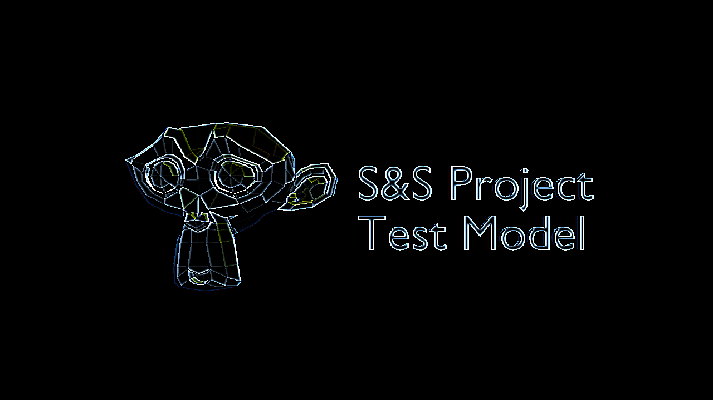
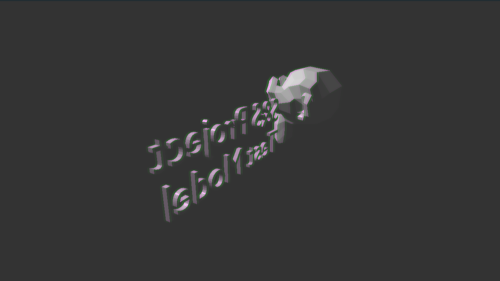
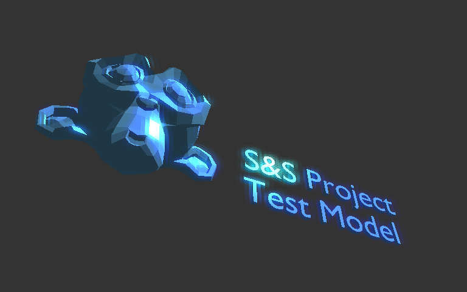

# Prototype-01
Signals &amp; Systems, course project.
## Introduction

Image processing always contains lots of floating point operations (Flops), so that deploying these computing to GPUs via modern OpenGL (with programmable shader support) make it more efficient and possible for realtimes use, because GPUs are designed for parallel computing.

Here's a brief comparing between two types of image processing:

| Items                | Traditional (CPU)  | OpenGL 4  (GPU) |
| -------------------- | ------------------ | --------------- |
| Parallel Computing   | By Multi-threading | Native Support  |
| Performance per Watt | < 5 GFlops         | 25 ~ 60 GFlops  |

  

In this project, we use the **Fragment Shader** in modern OpenGL to do the computing in some simple image processing operations.

The diagram shows the structure of the program

The image / input signal is distributed and sent to the fragment shader, then the original signal is convoluted with the two-dimentional impulse response matrix.

By changing the impulse response we can modify the behaviour of the system.

## Results

**Edge Detect**

  

**Blur**

**Edge Enhanced ** : Edge Detect + Original Signal

  

**Per RGB Channel** : blurring red component only.

**Edge Detect : **cascaded with Grayscale

  

**Bloom**

